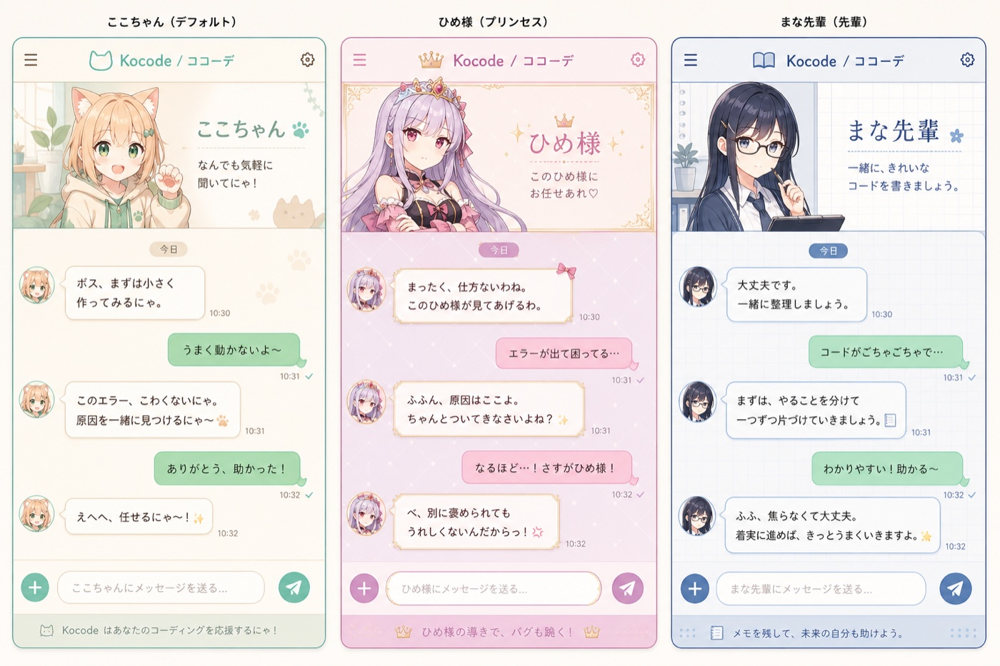

# Kocode / ココーデ

> はじめての vibe coding を、もっとやさしく、もっと人間らしく。

<p align="center">
  
</p>

**Kocode** is an anime-character-driven VS Code companion for students and
first-time vibe coders. Instead of feeling like a professional developer
dashboard, it aims to feel like a warm chat app where a favorite character is
beside you, helping turn vague ideas into something that works.

The product direction is simple:

**De-professionalize coding. Make the editor feel friendly, conversational, and
alive through character, dialogue, and gentle guidance.**

## Product Goal

Most coding tools assume the user already speaks like an engineer. Kocode goes
the other way. It avoids unnecessary technical words, explains unfamiliar ideas
gently, and helps people keep moving even when they only have a rough feeling
like "I want to make this kind of app."

Kocode is for people who want to start creating with AI before they know all
the professional vocabulary.

## Core Experience

| Direction | What It Means |
| --- | --- |
| やさしい会話 | Explain things in warm, simple language instead of dense technical terms. |
| キャラクター会話 | Let users choose a companion whose voice and visual theme make creation enjoyable. |
| チャット UI | Replace the cold tool-panel feeling with a LINE-like, bubble-based conversation experience. |
| Vibe first | Let users describe feelings, images, and rough ideas before exact requirements. |
| No jargon wall | If a technical word is needed, explain it softly with an example. |
| Human editing | Make code changes feel like a collaborative conversation, not a machine command. |
| Beginner-safe flow | Guide first-time users step by step without making them feel behind. |
| Cost-aware models | Use stronger models only when the task really needs them. |

## Character Themes

Kocode begins with three classic anime-inspired companion personalities and
their own visual chat themes:

| Character | Role | Conversation Style | Theme |
| --- | --- | --- | --- |
| `ここちゃん` | Default companion, sunny cat-girl | Calls the user `ボス`; warm and playful with a soft `にゃ` tone. | Cream and mint chat room |
| `ひめ様` | Proud princess companion | Light tsundere teasing while still giving clear help. | Pink and gold royal chat room |
| `まな先輩` | Serious glasses-wearing upperclassman | Calm, organized, reassuring explanations. | Blue notebook-style chat room |

See [docs/kocode-characters.md](./docs/kocode-characters.md) for the full
character bible and Japanese system prompt drafts.

## Who It Serves

- Students who want to try vibe coding for the first time.
- People who are curious about making apps but do not feel like "programmers" yet.
- Creators who have ideas, characters, stories, designs, or moods they want to turn into software.
- Beginners who feel stressed by professional tools, English jargon, or error messages.
- Japanese users who want a softer, more familiar coding experience.

## Tone Principles

1. Speak like a patient companion, not a senior engineer giving a lecture.
2. Prefer plain words. When jargon is unavoidable, translate it into everyday language.
3. Start from the user's feeling or goal before discussing implementation.
4. Make errors feel solvable, not embarrassing.
5. Let the character voice add warmth without getting in the way of serious work.
6. Treat coding as a creative activity, not only a professional skill.

## Planned MVP

- A dedicated Kocode chat interface in the VS Code sidebar, beginning with the `ここちゃん` theme.
- Character-themed headers, avatars, speech bubbles, and welcoming first-run conversation design.
- A soft Japanese-first conversation style for code creation and debugging.
- A beginner mode that avoids professional vocabulary where possible.
- Gentle error explanations that say what happened and what to try next.
- Later theme switching for `ひめ様` and `まな先輩`.
- Smart model routing so casual tasks stay affordable and hard tasks still get enough power.

## Status

This repository is the initial Kocode fork and rebranding baseline. The current
UI implementation work focuses on a standalone `ここちゃん` chat view in the
VS Code extension under [`apps/vscode`](./apps/vscode), while keeping the
original Cline interface available as a legacy fallback during migration.

The three-character image above is the visual direction for Kocode themes.
`ここちゃん` is the first implementation target; `ひめ様` and `まな先輩` are
planned themes, not yet complete product modes.

Internal `cline.*` command IDs, protocol paths, service integrations, and SDK
package names are intentionally retained during the initial migration so the
upstream code remains buildable while Kocode-specific experience work is
developed.

## Development

The extension package lives in `apps/vscode`.

```bash
cd apps/vscode
npm run install:all
npm run compile
```

The fork tracks upstream through the `upstream` Git remote:

```bash
git fetch upstream
```

## Upstream And License

Kocode is derived from [Cline](https://github.com/cline/cline), an open-source
project licensed under the [Apache License 2.0](./LICENSE). Original copyright
and license notices are preserved. Kocode is an independent product direction
and is not represented as an official Cline release.
